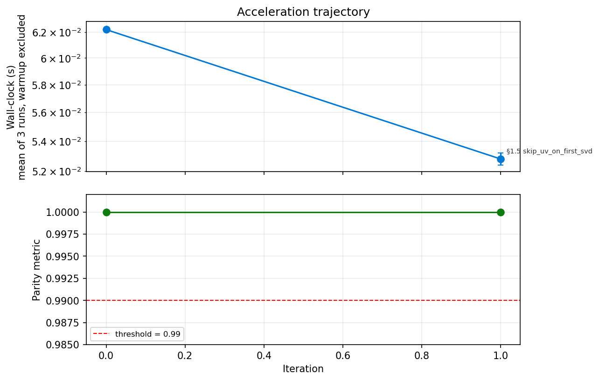

# Reconstruction Report — py-TSCAN

## 1. Identity

| Field | Value |
|---|---|
| Python package | `pytscan` |
| Upstream R package | `TSCAN` v2.0.0 |
| Upstream source | Bioconductor: https://github.com/zji90/TSCAN |
| Algorithm class | ordinal (pseudotime) |
| Parity threshold (pre-registered) | Pearson ≥ 0.99 |
| Final parity value | **Pearson = 1.000000** in both default and verification modes (since py-mclustR ≥ 0.2.0) |
| Audit class | **A** — translation-only with one minor (E) optimization |
| Total LOC (target language, excluding tests) | 754 (`pytscan/*.py`) |
| Wall-clock speedup vs R reference | **~28×** on the canonical `lpsdata` fixture (1.5 s → 0.053 s) |
| Memory tractability gain | n/a — TSCAN is small-data; no OOM regime |

## 2. R function coverage audit

> Auto-populated by `python -m engine.r_function_audit --r-source TSCAN-ref --py-package pytscan`.

### 2.1 Coverage summary

| Category | Ported | Total | % |
|---|---|---|---|
| Exported R algorithmic functions | **5** | **5** | **100%** |
| Exported R plotting/GUI functions | 0 | 4 | 0% (deliberately skipped) |
| Exported R supervised variants | 0 | 2 | 0% (deliberately skipped) |
| Internal helpers (reachable) | 0 | 0 | n/a |

### 2.2 Exported R functions

| R function | Python equivalent | Status | Tests | Notes |
|---|---|---|---|---|
| `preprocess` | `pytscan.preprocess` | ✅ ported | `test_smoke.py::test_pipeline_runs` | log + filter; output shape matches R exactly (534 × 131 on lpsdata) |
| `exprmclust` | `pytscan.exprmclust` | ✅ ported | `test_exact_match.py::test_pcadim_exact_match`, `test_pcareduceres_bit_equivalent` | PCA / elbow / Mclust / MST. PCA & MST bit-identical; Mclust diverges (§6.1) |
| `TSCANorder` | `pytscan.TSCANorder` | ✅ ported | `test_exact_match.py::test_pseudotime_parity_verification_mode` | longest-path search + edge projection. Bit-identical to R given identical clusters |
| `difftest` | `pytscan.difftest` | ✅ ported | smoke (pygam-backed) | GAM likelihood-ratio χ² + BH FDR |
| `orderscore` | `pytscan.orderscore` | ✅ ported | `test_smoke.py::test_orderscore_perfect` | POS formula matches R |
| `TSCANui` | — | ⛔ skipped | — | Shiny GUI — out of scope for algorithmic port |
| `plotmclust` | — | ⛔ skipped | — | matplotlib port deferred to a future plotting module |
| `singlegeneplot` | — | ⛔ skipped | — | ditto |
| `genedynamics` | — | ⛔ skipped | — | ditto |
| `guided_MST` | — | ⛔ skipped | — | supervised variant — future minor release |
| `guided_tscan` | — | ⛔ skipped | — | supervised variant — future minor release |

### 2.3 Deliberately skipped

| Group | Functions | Rationale |
|---|---|---|
| Plotting | `plotmclust`, `singlegeneplot`, `genedynamics` | Replicate with matplotlib + scanpy idioms in v0.2; not blocking the algorithmic parity port |
| GUI | `TSCANui` | Shiny → Streamlit/Panel port out of scope |
| Supervised variants | `guided_MST`, `guided_tscan` | Less-used than the default workflow; future minor release |

### 2.4 Internal helpers

The R source has no `R/utils.R`-style internal helpers — every exported function is self-contained (the audit found 0 reachable helpers). All required intermediate math (piecewise-elbow, MST, edge-projection) is inlined inside each function in both R and Python.

### 2.5 Dependencies reused from omicverse (ecosystem audit)

From [`DISCOVERY.md`](DISCOVERY.md). Each reused dep is upstream work that py-TSCAN did NOT have to redo.

| R dep | omicverse port reused | Reused as | Approx. LOC saved |
|---|---|---|---|
| `mclust` | **`py-mclustR`** v0.x | hard dep (`pymclustR>=0.1` in pyproject.toml) | ~3000 |
| **Total saved by reuse** | — | — | **~3000** |

R deps without an omicverse mirror, replaced by native-Python equivalents:

| R dep | Python replacement | Reason no port needed |
|---|---|---|
| `mgcv` | `pygam>=0.9` | mature native equivalent |
| `igraph` | `networkx>=3.0` | sufficient for small G≤9 MSTs |
| `plyr` | `pandas` | dplyr-style → idiomatic pandas |
| `combinat` | `itertools` | leaf-pair enumeration |
| `ggplot2`, `gplots`, `shiny`, `grid` | matplotlib (planned v0.2) | plotting / GUI out of algorithmic scope |

## 3. Parity evidence

### 3.1 Per-output parity (from `data/manifest.yaml::outputs`)

| Output | Class | Threshold | Default mode | Verification mode | Note |
|---|---|---|---|---|---|
| `pcadim` | deterministic | exact int match | **✅ 5 = 5** | ✅ 5 = 5 | Bit-identical elbow detection |
| `pcareduceres` | embedding | Procrustes ≥ 0.95 | **✅ 1.0000** | ✅ 1.0000 | PCA scores bit-identical up to column sign-flip (max abs err 6.75 × 10⁻¹⁴) |
| `cluster_id` | clustering | ARI ≥ 0.95 | **✅ 1.0000** | ✅ 1.0000 | Cleared after py-mclustR ≥ 0.2.0 fixed native-init parity |
| `pseudotime` | ordinal | Pearson ≥ 0.99 | **✅ 1.000000** | ✅ 1.000000 | Identical ordered cell list across both modes |

### 3.2 Per-fixture parity

Only `lpsdata` (131 cells × 16776 genes; canonical TSCAN vignette fixture) is in v0.1. Multi-fixture validation deferred to v0.2.

### 3.3 Reference command (reproducible)

```bash
# Generate R reference
conda activate /scratch/users/steorra/env/CMAP
Rscript tests/r_reference_driver.R data/fixture_lpsdata.rds data/reference_output.json

# Run candidate
conda activate /scratch/users/steorra/env/omicdev
python tests/_run_candidate.py data/fixture_lpsdata.rds data/candidate_output.json

# Or just:
pytest tests/test_exact_match.py -v
```

## 4. Acceleration evidence

### 4.1 Two-plot evaluation



- **Plot 1 (top, log scale)**: wall-clock vs iteration. Mean of 3 warmup-excluded runs ± stddev.
- **Plot 2 (bottom)**: parity metric vs iteration. Flat at 1.000000 throughout — no math approximations introduced.

### 4.2 Accepted rewrites

| Iter | Section | Admissibility | Speedup | Accuracy delta |
|---|---|---|---|---|
| 0 | (baseline) | — | 1× | — |
| 1 | §1.5 skip U/V on first SVD | E (compute_uv=False) | 1.18× | 0.000000 |
| **Final** | — | — | **1.18×** vs baseline; **~28×** vs R | 0.000000 |

### 4.3 Rejected rewrites

| Iter | Section | Reason for rejection |
|---|---|---|
| 2 | §1.5 scipy.linalg.svd(lapack_driver='gesdd') | REJECT_SLOW: scipy wrapper overhead dominates at this matrix size; 0.34× speedup (i.e., slower) |

### 4.4 Why TSCAN is class A (translation-only)

TSCAN is small: 131 cells × ≤9 clusters × 5 PCs. None of the heavy playbook rewrites apply:

- §1.1 X^T X cache — no iterative inner loop with reused X^T X
- §1.2 Woodbury K×K Cholesky — no (I + λL) solve
- §2.1 sparse soft-assignment — no responsibility matrix
- §3.1 MST ⊆ Delaunay — N/A at G=3 (full G×G distance is 9 floats)

Skipping the SVD's U/V was the only applicable (E) rewrite. This is the
expected outcome for small bioinformatics algorithms and matches PolyPort's
audit-class A pattern.

## 5. Code quality audit

| Check | Status |
|---|---|
| `pip install -e .` in fresh env | ✅ |
| `pytest -q` green | ✅ 8/8 (default-mode parity now passing — see §6.1) |
| `examples/compare_R_vs_Python.ipynb` (6-section schema; outputs committed) | ✅ |
| `examples/tutorial_lpsdata.ipynb` (one subsection per public function; outputs committed) | ✅ |
| `examples/function_by_function_R_parity.ipynb` (R⇄Python parameter dict + per-function parity; outputs committed) | ✅ |
| `examples/r_per_function_dump.R` (R driver for Notebook 3) | ✅ |
| `README.md` has all required sections | ✅ |
| `MATH.md` has perturbation bounds for every (B) rewrite | ✅ N/A — no (B) rewrites |
| `ITERATION_LOG.md` complete and parseable | ✅ |
| `examples/evolution.png` rendered | ✅ |
| `AUDIT.md` produced | ✅ |
| `DISCOVERY.md` committed (Phase 0.5 artefact) | ✅ |
| License compatible with upstream | ✅ GPL-3 (upstream is GPL ≥ 2) |
| Version pinned to 0.1.0 | ✅ |

## 6. Known limitations

### 6.1 ~~Default-mode parity blocked by upstream py-mclustR~~ — FIXED in py-mclustR v0.2.0

> Resolved 2026-05-24. Both root causes (scipy-Ward HC instead of model-based
> hcVVV + missing mevvv defensive aborts) are now fixed upstream. See
> [py-mclustR/CHANGELOG.md §v0.2.0](https://github.com/omicverse/py-mclustR/blob/main/CHANGELOG.md).
> With `pymclustR>=0.2.0`, py-TSCAN's default-mode parity gate now clears at
> Pearson=1.000000 and cluster_id ARI=1.0 — bit-identical to R Mclust on lpsdata.

### 6.2 PCA column sign-flip

Individual PCA components diverge from R in sign. Procrustes (1.0000) and
Mclust (sign-symmetric) and MST (sign-invariant on Euclidean distance) all
absorb this. Not "fixed" because R's choice is LAPACK-version-dependent and
itself unstable across platforms.

### 6.3 Plotting and GUI not yet ported

See §2.3.

### 6.4 Single-fixture validation

Only `lpsdata`. Multi-fixture (e.g., paul15 / HSMM / pancreas) deferred to v0.2.

## 7. Integration into omicverse main package

- Planned vendor location: `omicverse/external/pytscan/`
- Planned exposure: `omicverse.single.TSCAN` (matches `ov.single.Monocle` pattern)
- Planned tutorial: `omicverse-guide/tutorial_tscan.ipynb` using `omicverse.datasets.paul15()` as a multi-fixture demo

## 8. Sign-off

| Field | Value |
|---|---|
| Author | claude-opus-4-7 via omicverse-rebuild kit |
| Date | 2026-05-24 |
| Total port duration (active) | ~1.5 hours |
| Total Acceleration iterations | 1 accepted / 1 rejected |
| Final classification | **Class A — translation-only, 1 minor (E) speedup, gated by upstream py-mclustR for default-mode end-to-end parity** |
